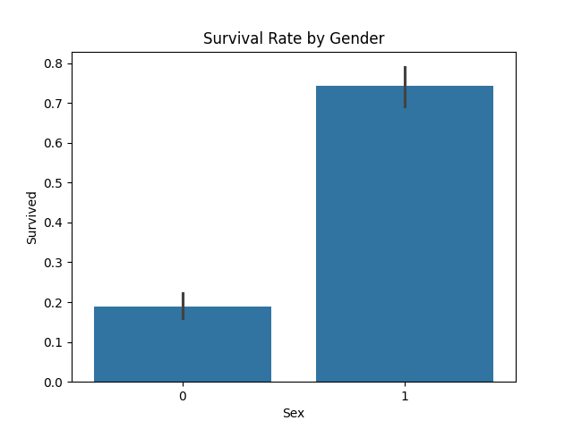
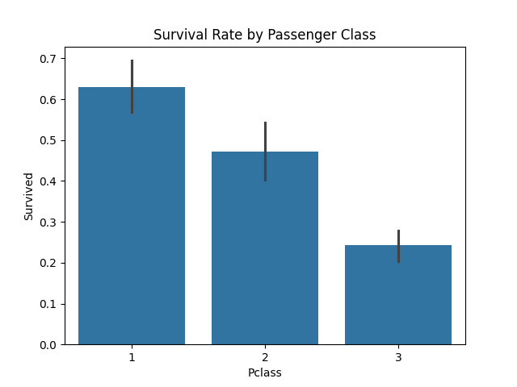
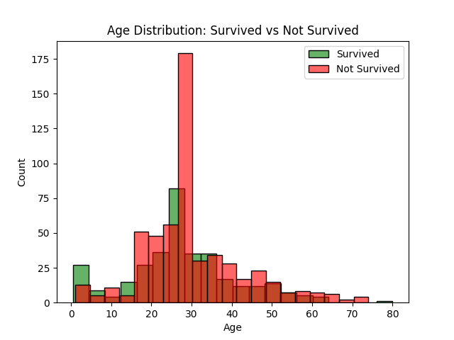
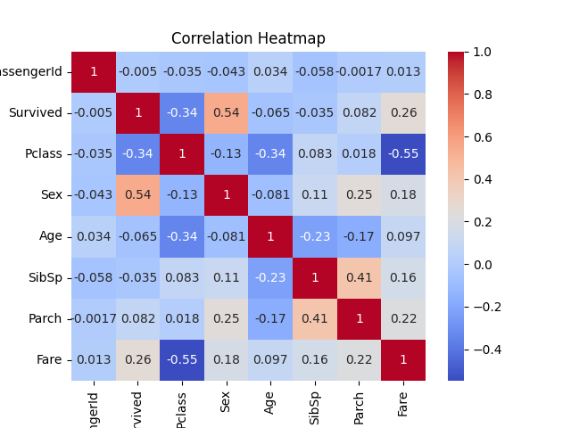

# Task 2: Exploratory Data Analysis on Titanic Dataset

This project is part of my **Elevvo Internship (Data Analytics track)**.  
The objective was to perform **Exploratory Data Analysis (EDA)** on the classic Titanic dataset to identify patterns and factors that influenced passenger survival.  

## 📂 Dataset
- Source: [Titanic: Machine Learning from Disaster (Kaggle)](https://www.kaggle.com/c/titanic)
- Data includes passenger details such as age, gender, ticket class, fare, and survival status.

## 🛠️ Tools & Libraries
- Python
- Pandas
- Matplotlib
- Seaborn
- Jupyter Notebook

## 🔎 Key Steps
1. **Data Loading** – Read Titanic dataset into Pandas DataFrame  
2. **Data Cleaning** – Handle missing values, drop irrelevant columns, encode categorical variables  
3. **Summary Statistics** – Inspect distributions and descriptive stats  
4. **Group-Based Insights** – Calculate survival rates by gender and passenger class  
5. **Data Visualization** – Create bar plots, histograms, and a heatmap for correlations  
6. **Insights & Conclusion** – Interpret results  

## 📊 Key Insights
- **Gender:** Women had a survival rate of ~74%, while only ~19% of men survived.  
- **Class:** 1st-class passengers survived at ~63%, while only ~24% of 3rd-class passengers survived.  
- **Age:** Children under 10 had noticeably better survival odds compared to adults.  
- **Fare:** Higher fares correlated with higher survival chances.  
- **Overall:** Survival was strongly influenced by **gender, class, and wealth**, with age playing a secondary role.  

## 📈 Visualizations

### Survival Rate by Gender

### Survival Rate by Class

### Age Distribution

### Correlation Heatmap

## ▶️ How to Run
- Install dependencies: `pip install -r requirements.txt`  
- Open the notebook: `jupyter notebook Titanic Survival Dataset Analysis.ipynb`
